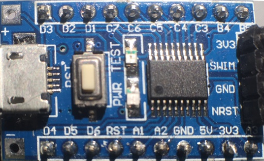

STM8 linux recipes
==================

These STM8 recipes are the result of my journey into STM8 programming on linux.
They all implement 1 thing so I can use it as a reference when needed in a more complex setting.

Feel free to use them however you like as they are released into the public domain.

Requirements
------------

These recipes work out-of-the box with what I think is the cheapest STM8 board available, the STM8S103F3P6 boards that
can be bought via the well known cheap channels for about € 0,60.

 
The same sites also sell dirt cheap programmers for less than € 2,00 but any ST-Link V2 should work.

The recipes are usable on any platform, with any toolchain.
But if you want to build, flash and run these little programs as they are presented, you need the tools below.

* sdcc : http://sdcc.sourceforge.net/
* stm8flash: https://github.com/vdudouyt/stm8flash.git

Recipes
-------
* blinky : the 'Hello world' of embedded using a busy loop (not a very good idea, but it doesn't get any simpler)
* blinky-timer : a more sensible blinking LED implementation using a timer
* serial : write every second a message to the UART
* pwm : output a varying PWM signal
* adc : measure analog signal using end-of-conversion
* awd : measure analog signal using analog watchdog
* pwm-awd-control : combined recipe where the measured analog value is used to control a PWM signal